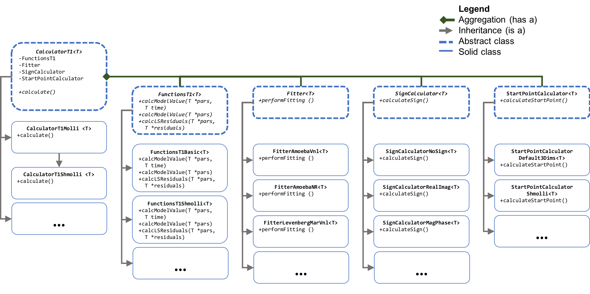

# Code structure

{:toc}

### Calculator class
Coming soon
{: .label .label-yellow }

### Filter class
Coming soon
{: .label .label-yellow }

### FunctionsT1 class
Coming soon
{: .label .label-yellow }

### SignCalculator class
Coming soon
{: .label .label-yellow }

### StartPointCalculator class
Coming soon
{: .label .label-yellow }

### ImageCalculator class
Coming soon
{: .label .label-yellow }
